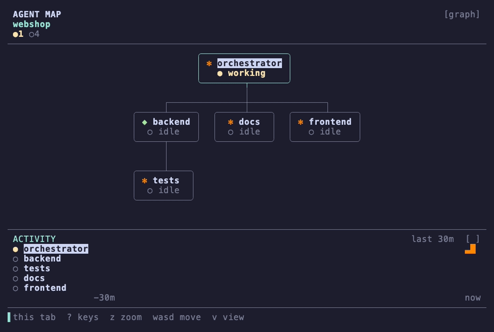
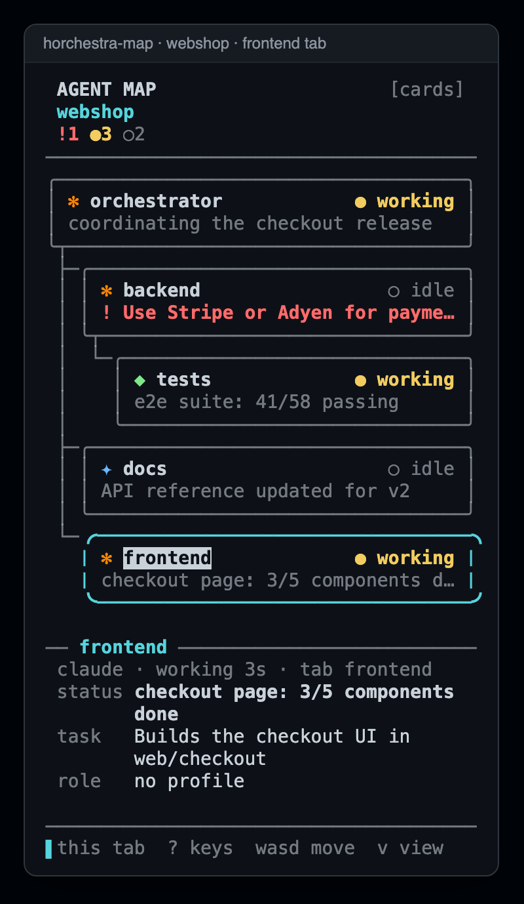
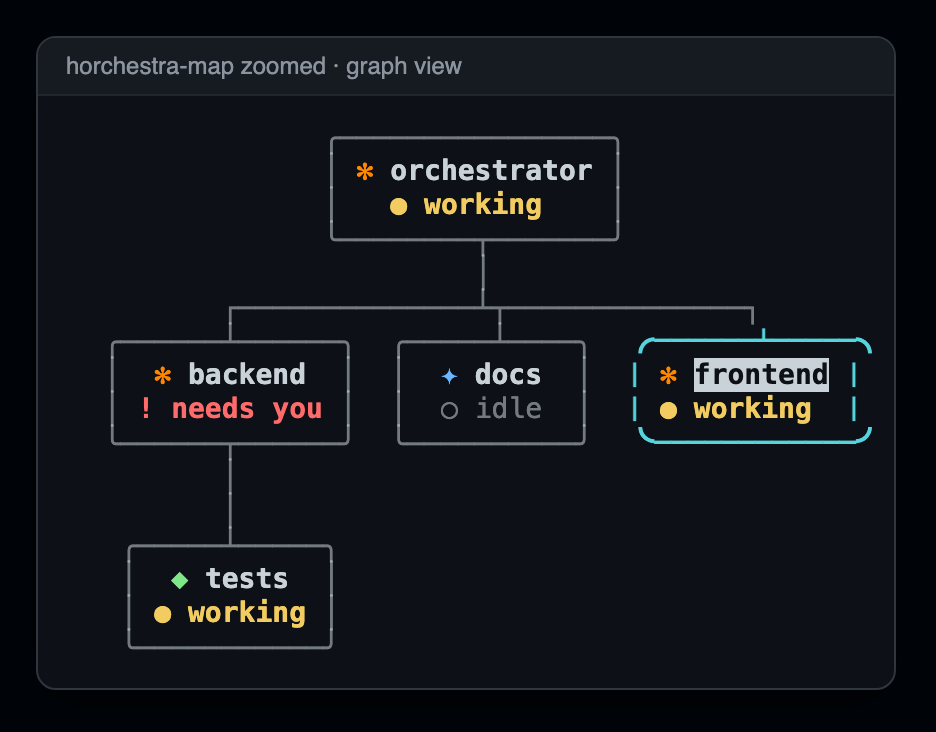
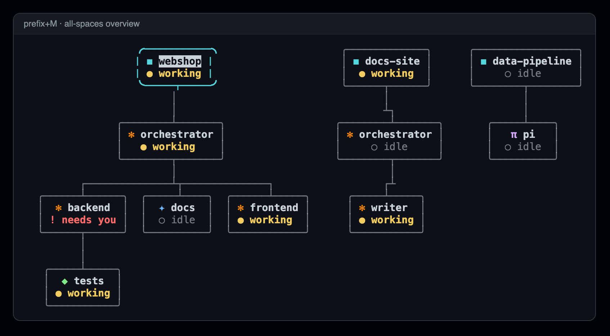
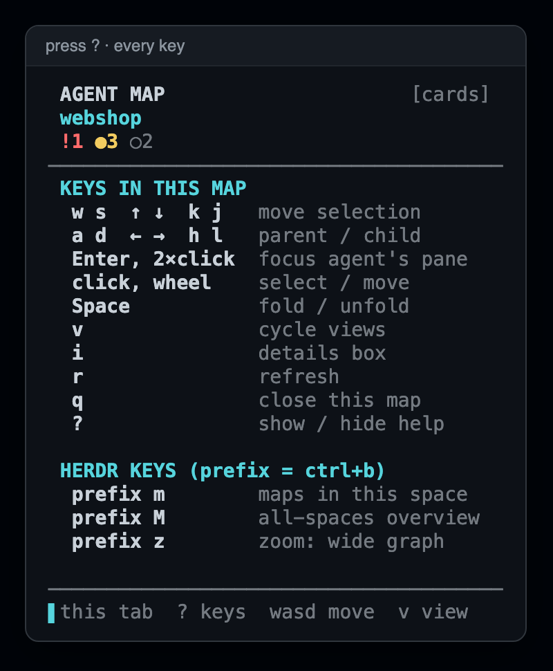

# Horchestra

[](https://github.com/SimoneDaniotti/horchestra/actions/workflows/ci.yml) [](https://codecov.io/gh/SimoneDaniotti/horchestra) [](LICENSE)

Orchestrator-led agent teams for [Herdr](https://herdr.dev), with a live
agent map in every tab.

Start one orchestrator in a space. It adopts the agents already running
there, hires new ones when the work needs them, and keeps the team in a
`team.toml` you can read and edit. Every agent tab gets a map of the team;
the agents in the tab you are looking at are highlighted.


<sub>Yellow: working · green: reported back · magenta: a message between agents · red: needs you. The activity plot underneath is read from each agent's own transcript. (A scripted demo team, sped up: `tools/demo/`.)</sub>

<table>
<tr>
<td></td>
<td></td>
</tr>
<tr>
<td align="center"><sub>Map in every agent tab: cards and details box</sub></td>
<td align="center"><sub>Same team as a graph</sub></td>
</tr>
</table>


<sub>`prefix+M`: the all-spaces overview along the bottom of a tab</sub>

## Requirements

- Herdr 0.9.3 or newer, on macOS or Linux (Windows is not supported yet)
- Python 3.11+ (standard library only; nothing to install)
- Claude Code 2.1 or newer for the orchestrator and for role profiles,
  `respawn`, and session names (tested with 2.1.289); members can be any
  agent Herdr can start (`claude`, `codex`, `gemini`, `pi`, …)
- Herdr's Claude/Codex integrations, so Herdr can resume agents after a
  restart (`herdr integration install claude`)

## Install

```bash
herdr plugin install SimoneDaniotti/horchestra
herdr plugin action invoke horchestra.setup
```

`plugin install` clones the public repository over HTTPS and needs no
credentials. Installing from a private fork needs git credentials (for
example `gh auth setup-git`).

`setup` adds the pieces that live outside the plugin directory, and prints
what it did:

| What | Where |
| --- | --- |
| `horchestra-team`, `horchestra-tag` commands | symlinks in `~/.local/bin` |
| `orchestrator` Claude Code session agent | symlink in `~/.claude/agents` |
| `prefix+m` toggles the maps, `prefix+M` the all-spaces overview | marked block in `~/.config/herdr/config.toml`, only for keys that are free |

It never overwrites files it did not create. A symlink in `~/.local/bin` or
`~/.claude/agents` is replaced (setup) or removed (teardown) only if it points
into a Horchestra plugin directory (one whose `herdr-plugin.toml` has id
`horchestra`, or the legacy `agent-map`). Your own symlinks with the same
names (say, an `orchestrator.md` from your dotfiles) are left alone: setup
reports them as SKIPPED and teardown as kept. Edits to Herdr's `config.toml`
are atomic and keep the file's permissions; a symlinked `config.toml` is
written through to its target. If an edit would make a valid config invalid
TOML, setup or teardown reports an ERROR and leaves the file unchanged. It also checks that Herdr's
Claude/Codex integrations are current (needed to resume agents after a Herdr
restart) and suggests turning on notifications if they are off.

## Quick start

In any space, open a tab and run:

```bash
claude --agent orchestrator
```

Then tell it what you want, or just "set up the team". On its first turn it:

1. registers itself as the space's orchestrator and creates `team.toml` at
   the project's git root (`horchestra-team init`)
2. finds agents already running in the space (`horchestra-team scan`) and adopts
   them, naming roles after their tabs, without restarting or messaging them
3. opens a map in every agent tab and summarizes the team

From then on it hires and fires members itself. You can drive the same
commands by hand.

## The map

`prefix+m` shows or hides a map in every tab of the space that runs an agent.
`prefix+M` (shift) shows or hides the **all-spaces overview**: a wide strip
along the bottom of the current tab with every space side by side, each with
its team underneath. Enter on a space switches to it; Enter on an agent jumps
to it. Press `?` in any map to see every key.

| Key / mouse | Action |
| --- | --- |
| `w` `s` / `↑` `↓` / `k` `j` / wheel | move selection up / down |
| `a` `d` / `←` `→` / `h` `l` | go to parent / first child |
| `Enter` / double-click | focus that agent's pane |
| `Space` | fold or unfold a subtree |
| `v` | cycle views: auto → cards → graph → compact |
| `i` | show or hide the details box (info) |
| `t` | show or hide the activity plot |
| `[` `]` | activity plot: shorter / longer window (10m · 30m · 1h · 3h · 12h) |
| `z` | zoom into the selected agent's session with [zoetrope](https://github.com/furkankly/zoetrope) |
| `W` `A` `S` `D` (shift) | dock the maps (or the overview) at the top / left / bottom / right; remembered |
| `r` / `q` | refresh / close this map |
| `?` | show or hide the list of keys |

- **cards**: one card per agent: icon, status, and a detail line (a
  needs-you question, the agent's reported status, or its task).
- **graph**: top-down tree. *auto* uses it whenever the pane is wide enough,
  e.g. when you zoom the map pane with `prefix+z`.
- **compact**: one line per agent.
- `▌` (cyan) marks agents in the map's own tab.
- **Live edges**, in every view (see Configuration to keep them still):
  - yellow, parent → child: the child is working;
  - green, child → parent: the child just reported (`horchestra-team report`);
  - red, child → parent: the child needs you (`report --needs-you`);
  - magenta, sender → receiver: a `horchestra-team message`; between two
    members it runs up to their common parent and down again.

  Report and message pulses run for about 6 seconds. Text the orchestrator
  types into a member with Herdr's own `agent prompt` shows only as the
  yellow working pulse.
- The **activity plot** under the map has one line per agent (one per space
  in the overview): how busy it was over the last 30 minutes. For Claude and
  Codex agents it comes from their own session transcripts (Herdr reports
  each pane's session id), including Claude subagents, so it covers time
  before the map opened. Other agents are sampled while the map runs. The
  transcripts are only read, never sent anywhere.
- **Zoom** (`z`) opens the selected Claude or Codex agent's session in
  [zoetrope](https://github.com/furkankly/zoetrope) over the map: its
  subagents, tool calls and a scrubbable timeline, following live. Quit
  zoetrope (`q`) to return to the map. Needs `zoe` installed
  (`brew install furkankly/tap/zoetrope` or `cargo install zoetrope`) and the
  agent's Herdr integration (`herdr integration install claude`).
- The **details box** shows the selected agent's kind, state and for how
  long, tab, reported status, task, and the last thing it said.
- `?` lists every key, in the map itself:

  

Icons: `✻` Claude · `◆` Codex · `✦` Gemini · `π` Pi.
Status: `●` working · `▲` blocked · `✓` done · `○` idle · `!` needs you.

## Teams

`team.toml` is the team's source of truth. It starts with only the
orchestrator and records each agent's session id so the team can be found
again after a Herdr restart:

```toml
default_kind = "claude"

[orchestrator]
kind = "claude"
session = "900a16f3-…"
# brief = "Optional standing goal for the orchestrator"

[[member]]
role = "slides"
kind = "claude"
task = "Designs the quarterly review deck in web/checkout/"
session = "a3ff62c9-…"
# reports_to = "research"   # nest under another member
# cwd = "web"               # relative folder inside the project
# args = ["--model", "sonnet"]
```

| Command | What it does |
| --- | --- |
| `horchestra-team init` | register the calling agent as orchestrator; open maps |
| `horchestra-team scan` | list running agents in the space that are not on the team |
| `horchestra-team adopt <pane> --role R [--task T]` | add a running agent, unchanged |
| `horchestra-team hire R --kind K --task T [--profile P] [--only-skill S] [--uses-skill S] [--deny-skill S]` | add a member: own tab named after the role, start the agent with its role profile, send its brief |
| `horchestra-team fire R` | remove a member from team.toml and close its pane (refused for `orchestrator`; see below) |
| `horchestra-team status` | show the team, with each member's latest reported line |
| `horchestra-team message R "text"` | send a message to a team agent by role (e.g. `orchestrator`); queued if it is busy |
| `horchestra-team sync` | apply a hand-edited team.toml: start missing members, repair names and map links |
| `horchestra-team roles` | list role profiles in `.orchestra/roles` and who uses them |
| `horchestra-team respawn R \| --all` | restart a Claude agent in place with its current profile, keeping its conversation |
| `horchestra-team reopen` | recreate a closed space from team.toml: one tab per role, every agent resumed with its conversation and profile |
| `horchestra-team forget` | stop restoring the current team after Herdr restarts (`up` registers it again) |
| `horchestra-team up` | start `claude --agent orchestrator` in the current pane (also the `horchestra.team-up` action) |

Which commands create team.toml: only `up`, `init` and `adopt`, and they
refuse to do so directly in your home folder or at `/` unless you pass
`--file PATH` (a `.git` in your home folder, such as a dotfiles repo, does not
make it a project root). `scan` and `roles` work without a team.toml and never
create or register one; `status`, `sync`, `hire`, `fire`, `message` and
`respawn` never create one either.

team.toml is type-checked on load and errors name the field (e.g.
`member[0] (qa).args must be a list of strings`). `args = "x y"` (a single
string) is treated as one argument. `cwd` must be a relative folder inside the
project. Horchestra honours `CLAUDE_CONFIG_DIR`: it looks for the orchestrator
agent at `$CLAUDE_CONFIG_DIR/agents/orchestrator.md` and for resumable
sessions in `$CLAUDE_CONFIG_DIR/projects` (default `~/.claude`).

`fire R` works only for a member listed in team.toml (never `orchestrator`); a
pane that merely carries the `team:R` label is not closed. It closes the pane
only if that pane runs the session recorded in team.toml. If no session is
recorded yet, the pane must carry the `team:R` label and the map's role tag,
and no other pane may have the same label. Otherwise the member is still
removed from team.toml, the pane stays open, and a note names it. If `hire`
fails after the pane was created or the agent started (e.g. a folder-trust
prompt timed out), the member stays in team.toml: answer the prompt in the
named pane, then run `horchestra-team sync`. `sync` reports stray `team:*`
panes and tells you to close them by hand.

Names stay in step with roles:

- each hired member gets its own tab named after its role, and every
  `horchestra-team` command renames an agent's tab to its role when it is the
  only agent in that tab, and only when that role's own agent is running there (set `name_tabs = false` in team.toml to turn off)
- Claude members and the orchestrator are started with `--name <role>`, so the
  conversation (prompt box, `/resume` picker, terminal title) has the same
  name; `respawn` and the restart repair apply it again
- panes are labelled `team:<role>`, and Herdr agent names are
  `<folder>-<hash>-<role>` (e.g. `webshop-3f2a-slides`; the hash is a short
  digest of the project path, so two projects with the same folder name do not
  collide) for `herdr agent prompt <name> "…"`. A team whose pane already holds
  the old plain name (`<folder>-<role>`) keeps it; if Herdr drops the name on
  a restart, that member moves to the hashed name and restore re-applies it.
  `horchestra-team message <role>` works either way, since it goes by role

### Role profiles: each member's own instructions and skills

Give a role its own context with a folder in the project:

```text
.orchestra/roles/slides/
├── ROLE.md                      # the member's own instructions
├── CLAUDE.md                    # optional extra memory for this role
└── .claude/skills/deck-style/   # skills only this role gets
```

`hire slides` picks the folder up automatically (or `--profile <folder>`),
and team.toml can add skills to use or block:

```toml
deny_skills = ["legacy-*"]                # blocked for every hired member

[[member]]
role = "slides"
only_skills = ["deck-style"]             # allowlist (role-folder skills stay allowed)
# uses_skills = ["deck-style"]          # or: skills it must use, others still allowed
# deny_skills = ["chart-kit"]           # block specific names or patterns
```

`only_skills` puts "use only these skills" in the member's instructions and
blocks every other skill found in the user skills folder (`$CLAUDE_CONFIG_DIR/skills`, default `~/.claude/skills`) and the project's
`.claude/skills`. Skills from Claude Code plugins and built-ins cannot be
listed from disk, so for those only the instruction applies.

For a Claude member, hiring generates a session agent
`.claude/agents/horchestra-<role>.md` (team context + ROLE.md + skills to use)
and starts it with `claude --agent horchestra-<role> --settings <deny rules>
--add-dir <profile folder>`. The member still sees the project's own
CLAUDE.md and skills. Other agent kinds get the same instructions in their
first message. Horchestra rewrites `.claude/agents/horchestra-<role>.md` only
if it carries its `<!-- generated by horchestra` marker; if you wrote a file
with that name yourself, hire and respawn stop with an error asking you to
rename the file or the role.

For Claude agents, `args` (in team.toml or `hire --arg`) may not contain flags
Horchestra sets itself: `--agent`, `--settings`, `--add-dir`, `--resume`/`-r`,
`--continue`/`-c`, `--system-prompt-snapshot`, `--name`/`-n`,
`--append-system-prompt(-file)`, `--system-prompt(-file)`.

What is and is not guaranteed (tested with Claude Code 2.1):

| | |
| --- | --- |
| Role instructions | in the member's system prompt; kept by `claude --resume` |
| Role-only skills | available, from the profile folder |
| Denied skills | cannot be used (the call is refused), but are still listed |
| `only_skills` | instruction for all skills; hard block for skills on disk; plugin and built-in skills rely on the instruction |
| After a Herdr restart | the startup hook re-applies each member's profile (see below) |

Check a member from its pane with `/skills` and `/context`; `horchestra-team
status`, `horchestra-team roles`, and the map's details box show each member's
profile.

**Applying a profile to a running agent.** `horchestra-team respawn <role>`
quits the member's Claude session and restarts it in the same pane with
`claude --resume <its session> --system-prompt-snapshot off` plus its profile
flags. It keeps its whole conversation and gains the role instructions,
skills, and deny rules. Use it after adopting an agent, after editing a
ROLE.md, or with `--all` for the whole team. Wait until the member is idle
(or pass `--force`). Claude only; it takes a few seconds per member.

### Onboarding: when to call a member, how it gets work, when it reports

Before hiring (or right after adopting) a member, the orchestrator runs a
short interview with you. For that member it proposes two or three concrete
options each for:

- **call when**: which work goes to it ("UI or CSS changes under web/");
- **handoff**: how it receives work ("one task at a time, under an hour each");
- **reporting**: when it reports back beyond finishing ("a status line at
  each milestone", "ask before deleting files").

In Claude Code these appear as multiple-choice questions; you can always
write your own answer. The answers become the member's working agreement:

```bash
horchestra-team hire fe --task "checkout page" \
  --call-when "UI or CSS changes under web/" \
  --handoff "one task at a time, under an hour each" \
  --reporting "a status line at each milestone"
horchestra-team onboard docs --call-when "anything user-facing changes"   # adopted or later
```

The agreement is saved in team.toml, written into the member's agent file
(with a list of its teammates and when to call each), sent to the member if
it is running, and listed by `horchestra-team status`, where the orchestrator
routes work from.

### Tasks

Work goes out as numbered tasks and comes back closed:

```bash
horchestra-team assign fe "add a coupon field"     # orchestrator: records and sends task #2
horchestra-team done 2 "coupon field added"        # member: closes it and tells the orchestrator
horchestra-team blocked 2 "need the API keys"      # member: cannot finish
horchestra-team tasks [--all]                      # open and blocked tasks (or every task)
horchestra-team cancel 2 "postponed"               # orchestrator
```

`hire --task` records task #1 the same way. `done` and `blocked` message the
orchestrator (`[horchestra] message from fe: task #2 done: …`) and update the
member's line in the map, so nobody has to poll. If a member goes idle while
it still has an open task (it never ran `done`), a Herdr event hook sends
the orchestrator a note to check its output, at most once every 10 minutes
per task. Restart and reopen notes list the tasks still open.

Tasks live in `.orchestra/tasks.json` in the project, written under a lock so
members finishing at the same time cannot lose an update.

### Status lines and "needs you"

Members keep their own line in the map:

```bash
horchestra-team report "tests 3/5 passing"
horchestra-team report --needs-you "Use v1 or v2 API docs?"
horchestra-team report --clear
```

`report` only updates the map (and `status`); to tell the orchestrator
something other than a finished task, a member runs
`horchestra-team message orchestrator "…"`, which
arrives in the orchestrator's conversation as
`[horchestra] message from <role>: …`. Hired and respawned members have both
commands in their instructions; the orchestrator tells adopted ones.

A needs-you report shows `!` until the agent works again and sends a Herdr
notification. Herdr's own "agent finished / needs input" alerts cover
the rest. Both follow `[ui.toast]` in Herdr's config, which is off by default:

```toml
[ui.toast]
delivery = "system"   # or "herdr" for in-app toasts
```

### After a Herdr restart

Herdr resumes the agents' conversations itself when its Claude/Codex
integrations are current. The plugin's startup hook then:

- matches resumed agents to roles by session id and restores names, labels
  and map links
- sends a resumed orchestrator a short note listing who came back (not after
  a live handoff, where nothing restarted)
- starts a fresh orchestrator in its pane if its conversation could not be
  resumed
- closes and reopens map and overview panes, which come back as idle shells,
  only when they keep their `horchestra-map` / `horchestra-overview` title,
  run no agent, and have only an idle shell in the foreground (checked with
  `herdr pane process-info`); panes titled with the pre-0.1 `Agent map` name
  are never closed automatically
- respawns every Claude member launched with a profile, because Herdr's plain
  `claude --resume` would bring back the instructions recorded when the
  conversation began; the orchestrator is refreshed from the current
  `orchestrator.md` the same way

Restore repairs each team on its own: one broken team.toml, or a pane that
disappears mid-way, does not stop the other teams; a failing team is retried
and dropped after 3 failures. Registered team files that no longer exist are
dropped. If two registered team.toml files share the same agent sessions (a
copied project), only the team whose folder holds those agents' working
directory is restored; when that cannot be told, both are skipped with a log
message. Give the copy a fresh team.toml. `respawn` and the profile
re-apply and orchestrator re-brief never restart or message a pane matched by
label alone; two panes with the same `team:R` label are reported as ambiguous.
`sync`/`status` never record the session of a pane found only by its label:
a recorded session is replaced only by an agent Horchestra started, an
explicit `adopt`/`init`, or a new conversation in the role's own terminal.

Members whose conversation did not resume are reported to the orchestrator,
never restarted automatically, so nothing runs twice. Results are in
`herdr plugin log list --plugin horchestra`.

### Closing and reopening a space

`team.toml` records every agent's conversation, so a team survives closing
its whole space. From a shell in any space:

```bash
cd ~/path/to/project
horchestra-team reopen
```

It creates a space named after the project, opens one tab per role in team
order, resumes each agent's own conversation with its profile and name
(`claude --resume …`, `codex resume …`), reopens the maps, and tells the
orchestrator who came back. A member whose conversation no longer exists on
disk starts fresh with its task. It refuses while any pane, in any space, still runs one of the team's
sessions or is a `team:<role>` pane inside the project folder; use `sync` in
that space, or close those panes first. Extra panes, splits and scrollback are not restored; work on disk
is untouched by closing a space, but an agent's in-progress turn is lost, so
close when agents are idle.

## Configuration

| Setting | Where | Default |
| --- | --- | --- |
| Map width (docked left/right) | a number in `$(herdr plugin config-dir horchestra)/width` | 32 |
| Map height (docked top/bottom) | a number in `…/height` | 14 |
| Map side | shift+W/A/S/D in a map, or `left`/`right`/`top`/`bottom` in `…/map_side` | `left` |
| Overview side | shift+W/A/S/D in the overview, or `…/overview_side` | `bottom` |
| Edge animation | `off` in `$(herdr plugin config-dir horchestra)/animate` (or `HORCHESTRA_ANIMATE=0`) | on |
| Map toggle key | the managed block in Herdr's config, or bind `horchestra.toggle` yourself | `prefix+m` |
| Overview key | the managed block, or bind `horchestra.overview` yourself | `prefix+M` (`prefix+shift+m`) |
| Team-start key | bind the `horchestra.team-up` action | none |
| Default member agent | `default_kind` in team.toml | `claude` |
| Plugin state | `HORCHESTRA_STATE_DIR` | `~/.local/state/horchestra` |

### Upgrading from the pre-0.1 names

Earlier builds were called `agent-map` with `agentmap-team` /
`agentmap-tag`. Re-run `horchestra.setup` after installing: it replaces the
old key binding, links the new commands, keeps `agentmap-team` /
`agentmap-tag` as deprecated aliases (running agents may still use them), and
the state folder moves to `~/.local/state/horchestra` on first use. Run
`horchestra-team respawn --all` and `respawn orchestrator` so running agents
get instructions with the new names.

## Uninstall

```bash
herdr plugin action invoke horchestra.teardown
herdr plugin uninstall horchestra
```

`teardown` removes only what `setup` added. `team.toml` files in your
projects and the state directory are left in place.

## How it works

- Uses only Herdr's public surfaces: the `herdr` CLI and the documented event
  socket. No private TUI protocol, no screen scraping for state.
- Events only trigger a fresh read, and unknown fields are ignored, so new
  Herdr releases can add fields or events without breaking it.
- The map reconnects with backoff after server restarts and updates, and
  falls back to polling if subscriptions are rejected.
- Agent relationships are pane tokens (`agentmap_parent`, `agentmap_role`,
  …) shown by the map; `team.toml` and session ids make them durable.

## Security

The plugin runs as your user. `setup` writes symlinks into `~/.local/bin` and
`~/.claude/agents` and a marked block into Herdr's config; the startup hook
and `hire` start agents on your machine. Read `install.py` and
`herdr-plugin.toml` before installing, as with any Herdr plugin.

## Known limits

- An agent restarted before it ever replied has no saved conversation and
  cannot be resumed (a fresh orchestrator is started; such members are
  reported).
- Each map takes about 32 columns (or 14 rows) in its tab. Herdr moves panes
  only by keyboard or command, not by dragging, so maps are docked with
  shift+W/A/S/D; dragging a border still resizes them. Docked top or bottom
  in a tab split into columns, a map spans the pane it docks against, not
  the whole tab.
- `hire` and `fire` rewrite team.toml, dropping comments added by hand.
- Files in `~/.claude/agents` are also offered as subagents in every Claude
  session; the orchestrator's description asks Claude not to use it that way.
- Manually tagged panes (`horchestra-tag`) lose their tags on a Herdr restart.
- A Codex member running in a read-only sandbox cannot reach Herdr's socket,
  so it cannot `report` or `message`; the orchestrator can still message it
  and read its output.
- Hiring a Claude member writes `.claude/agents/horchestra-<role>.md` into the
  project; commit it or add `.claude/agents/horchestra-*.md` to `.gitignore`.

## Development

```bash
gh repo clone SimoneDaniotti/horchestra   # or git clone https://github.com/SimoneDaniotti/horchestra
cd horchestra
herdr plugin link .            # run your working copy
python3 install.py install     # same as the setup action
python3 -m unittest discover -s tests -t .
```

README screenshots are real map output: `herdr pane read <map-pane> --format ansi
> map.ansi`, then `python3 tools/ansi2html.py map.ansi map.html --squeeze` and a
headless-browser screenshot of the page. The animated demo is the real map
driven by a scripted team and a stand-in `herdr` (`tools/demo/`); record it
with [vhs](https://github.com/charmbracelet/vhs): `vhs tools/demo/demo.tape`.

## Credits

Horchestra is built on [Herdr](https://herdr.dev)'s plugin system and
public CLI. Several ideas came from other Herdr plugins; no code was copied
from them:

| Idea | From |
| --- | --- |
| Card-style agent nodes and a tree/graph view of agents | [herdr-world](https://github.com/IvoryHeart/herdr-world) |
| A details box for the selected item under the graph | [herdr-dagr](https://github.com/aemrebarut/herdr-dagr) |
| Agent-reported progress, "needs you" flags, adopting agent panes you already started | [herdr-projects](https://github.com/eliasstravik/herdr-projects) |
| Per-vendor agent icons and colours | [herdr-radar](https://github.com/hhdebb/herdr-radar), herdr-world |
| Nesting agents under the agent that spawned them | [herdr-pi-tree](https://github.com/edxeth/herdr-pi-tree) |
| A side panel that sits next to each agent tab | [agent-panel](https://github.com/flowy11/agent-panel) |
| Edges that light up while an agent runs, an activity sparkline from session transcripts; `z` opens zoetrope itself | [zoetrope](https://github.com/furkankly/zoetrope) |

## License

MIT
